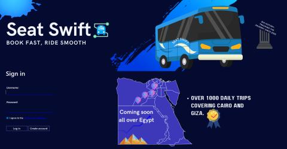
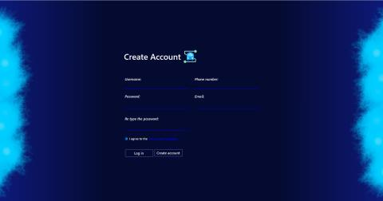
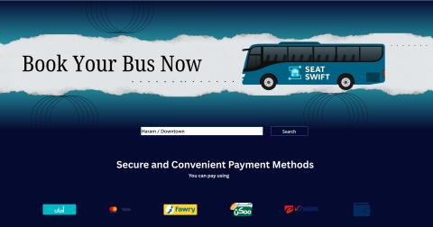
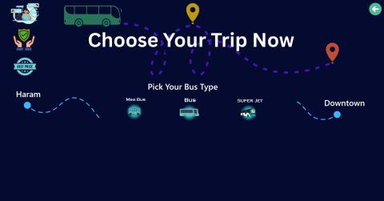
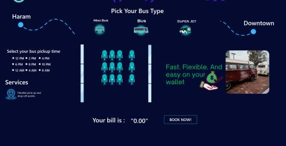
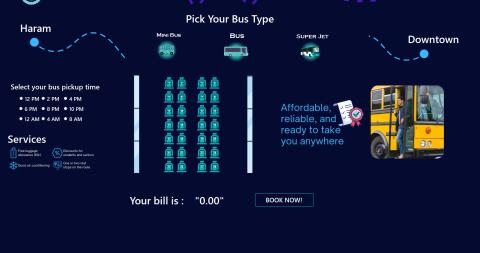
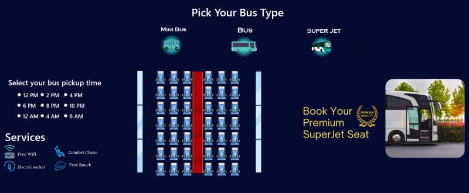
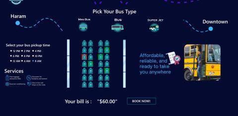
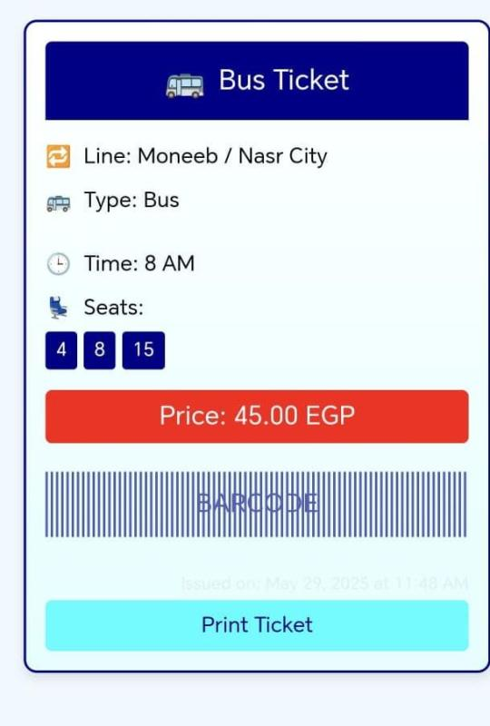

# Bus Reservation System

A hybrid C++ application combining a robust console-based management system with a Windows Forms (C++/CLI) graphical user interface. The system features seat selection, trip scheduling, user authentication, and a web-based e-ticket viewer with QR code integration.

## Project Overview

The Bus Reservation System is a system that simulates real-world bus ticketing, combining both C++ and JavaScript logic.

- **Users** can sign up, log in, browse available bus trips, book specific seats, and receive generated e-tickets with QR codes.
- **Administrators** can manage the entire system, including adding new users, creating buses and routes, scheduling trips, and managing reservations.
- Application data is stored persistently in lightweight CSV files under the `data/` directory, avoiding the need for heavy SQL database dependencies.

The application is built around a clear separation of concerns, supporting both a native C++ console interface and a Windows Forms GUI:

```text
Windows Forms GUI / Console Interface
-> C++ Core Logic
-> Data Migration Layer
-> CSV Manager
-> CSV Files
```

## Technology Stack

- **Language:** C++ (Standard C++ for core/console, C++/CLI for GUI)
- **UI Framework:** Windows Forms (WinForms) via C++/CLI
- **Build Tool:** MSBuild (via Visual Studio) / GCC (for console-only compilation)
- **Runtime Target:** Native Windows / .NET Framework
- **Persistence:** Portable CSV files
- **E-Ticket System:** HTML/CSS/JS with embedded QR codes

## Core Features

### User Features

- User signup and secure login.
- Visual seat selection interface for booking.
- Dynamic pricing based on bus type (Mini-bus, Air-Conditioned, Super Jet).
- E-Ticket generation with viewable HTML ticket and QR code.
- Support for people with special needs.

### Admin Features

- Admin login and dashboard.
- User management (Add/Remove users from the system).
- Bus management (Register new buses, assign capacities and types).
- Route management (Create and edit transit routes).
- Trip scheduling (Assign buses to routes with departure times and prices).
- Reservation management (View and cancel active bookings).

## App Snapshots

| Screen | Preview | Description |
| --- | --- | --- |
| Login & Create Account |  | The entry point of the system, where users can either log in or create a new account. Users must ✅ agree to the terms and conditions before proceeding. |
| Create Account |  |  A clean registration form requiring users to fill in all necessary information to successfully create an account.|
| Line Selection |  |  After logging in, users select a travel line (route) they want to book. Each line corresponds to a specific destination. |
| Bus Selection |  | Users can view available buses for their selected line and choose the one they want to book. 
| Bus Selection – Mini Bus |  | Users can select the Mini Bus, view its included services, pick a departure time, and select seats on the interactive map. |
| Bus Selection - Standard Bus |  |
| Bus Selection - Super Jet |  |
| Seat Selection |  | Users can select multiple seats at once and have the flexibility to cancel any seat selection before confirming. The total price updates automatically on the screen in real-time, making the booking process clear and convenient. |
| Ticket View |  | The finalized ticket is displayed clearly on the user’s mobile device, showing all essential details — including route, bus type, seat/s numbers, departure time.|
| Ticket QR Code |  | Once confirmed, a QR code is generated. Scanning it with a mobile device opens the digital ticket via a local server for easy access. |

*(Note: Replace placeholders with actual screenshots)*

## Architecture

### Presentation Layer

Contains the Windows Forms views (`MyForm`, `CreateAcc`, `Booking`, `lines`) and the terminal-based Console Interface.

Responsibilities:
- Read user input via forms or standard input.
- Validate login credentials against the database.
- Present visual seat mappings.
- Trigger data-layer operations for reservations.

### Core Logic Layer

Contains the business operations and validation.

Important classes include:
- `user.h` / `user.cpp`
- `bus.h` / `bus.cpp`
- `route.h` / `route.cpp`
- `trip.h` / `trip.cpp`
- `qrgenerator.h` / `QR.cpp`

Responsibilities:
- Enforce domain rules (preventing double booking of seats).
- Generate QR ticket data.
- Manage entities in memory before persisting.

### Data Layer

The data layer is centered around managing seamless file operations:

- `csvmanager.h`: Manages all direct read/write file operations to CSVs.
- `datamigration.h`: Acts as the Data Access Layer mapping C++ objects to CSV records.
- `database.h`: Initializes the environment and ensures CSV files exist.

## Persistence Design

The project uses file-backed persistence. Data files are stored in:

```text
data/
```

Main files:
```text
data/users.csv
data/buses.csv
data/routes.csv
data/Trips.csv
data/reservations.csv
```

### CSV Manager

`csvmanager.h` handles all file I/O safely. Key responsibilities:
- Read specific lines or columns.
- Append new records without corrupting existing data.
- Update specific fields (e.g., updating a seat from 'available' to 'booked').

## Package Structure

```text
Bus-Reservation-System/
|-- data/            # CSV Database files
|-- include/         # C++ Header files (.h)
|-- lib/             # External libraries (if any)
|-- resources/       # GUI assets (images, icons)
|-- src/             # C++ Source files (.cpp)
|   |-- gui_main.cpp # Windows Forms entry point
|   `-- main.cpp     # Console application entry point
|-- web/             # E-ticket HTML/JS/CSS viewer
`-- README.md
```

## Running the Project

### Prerequisites

- **Visual Studio** (Recommended: VS 2022 Community)
- Workloads: "Desktop development with C++" and "C++/CLI support" enabled.

### Run with Visual Studio (GUI Version)

1. Open the project folder in Visual Studio.
2. Ensure the compiler is set to use the `/clr` flag for C++/CLI files.
3. Set `src/gui_main.cpp` as the entry point.
4. Build and Run (F5).

### Run Console Version

If you do not have Visual Studio, you can compile the console version using `g++` on MSYS2:

```bash
g++ -Iinclude src/bus.cpp src/main.cpp src/route.cpp src/trip.cpp src/user.cpp -o bus_system.exe
.\bus_system.exe
```

## Historical SQL/ODBC Implementation

The `beta-version/` directory contains an earlier iteration of the project that successfully implemented a full SQL database connection using `nanodbc`. While the backend data management was fully functional with ODBC, integrating the SQL connections securely and efficiently with the C++/CLI Windows Forms GUI proved complex. To maintain a portable and unified project architecture, the final release transitioned to the lightweight CSV-based persistence model found in the `data/` folder. The `beta-version` remains in the repository as a historical reference of the successful SQL/ODBC implementation.

## License

This project is developed as part of a university course.
